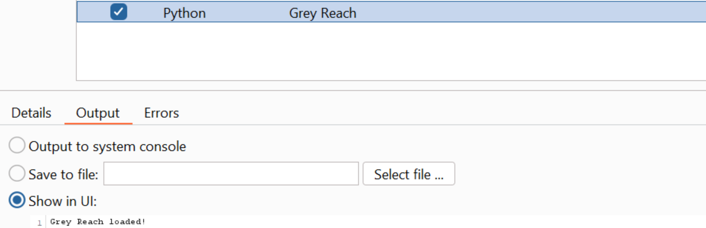

# Grey Reach

  

A BurpSuite Professional plugin aimed at deepening the coverage of blackbox/greybox tests by reaching non-default conditional blocks.
Full description of the problem it aims to help with: https://hackingiscool.pl/reaching-non-default-conditional-blocks-during-grey-and-blackbox-webapp-testing/.

# Using the plugin
## Load:

## Triggering acive scans:

The results will appear in the target section, just like any other items discovered by Active Scanner.
The audit items schedule is visible in the "Extension driver active audit" dashboard section.

## Parameter exclusion:

## Viewing debug output:

